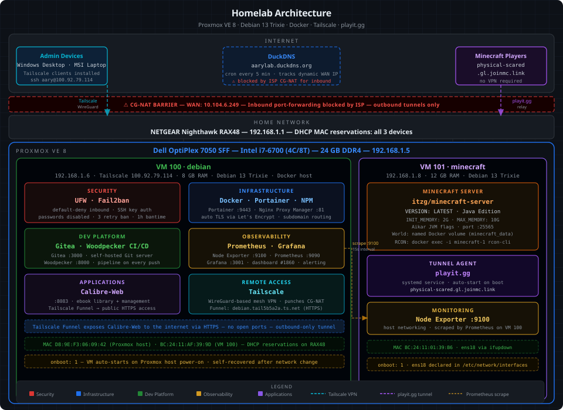

# Homelab
> Self-hosted DevOps stack on Proxmox VE · Debian 13 Trixie · Docker

## Architecture



## Hardware

| Component  | Details                                                     |
| ---------- | ----------------------------------------------------------- |
| Host       | Dell OptiPlex 7050 SFF                                      |
| CPU        | Intel Core i7-6700 (4C/8T, 3.4 GHz)                        |
| RAM        | 24 GB DDR4                                                  |
| Hypervisor | Proxmox VE 8                                                |
| Network    | NETGEAR RAX48 — DHCP MAC reservations for all three devices |


## Virtual machines

| VM                   | IP            | OS               | RAM   | Role                       |
| -------------------- | ------------- | ---------------- | ----- | -------------------------- |
| VM 100 · `debian`    | `192.168.1.6` | Debian 13 Trixie | 8 GB  | Docker host — all services |
| VM 101 · `minecraft` | `192.168.1.8` | Debian 13 Trixie | 12 GB | Dedicated game server      |

Both VMs are set to `onboot: 1` — they auto-start whenever the Proxmox host boots.

## Stack

| Layer      | Tool                                     | Purpose                                              |
| ---------- | ---------------------------------------- | ---------------------------------------------------- |
| Hypervisor | Proxmox VE 8                             | VM provisioning and management                       |
| Firewall   | UFW                                      | Default-deny inbound, explicit port allowlist        |
| IDS        | Fail2ban                                 | Auto-bans IPs after repeated failed logins           |
| VPN        | Tailscale                                | Mesh VPN for remote admin — punches through CG-NAT   |
| DNS        | DuckDNS (`aarylab.duckdns.org`)          | Dynamic hostname updated every 5 min via cron        |
| Proxy      | Nginx Proxy Manager                      | Reverse proxy + automatic TLS (Let's Encrypt)        |
| Management | Portainer                                | Container UI and Docker Compose stack management     |
| Git        | Gitea                                    | Self-hosted version control                          |
| CI/CD      | Woodpecker                               | Automated pipelines triggered on every Gitea push    |
| Metrics    | Prometheus + Node Exporter               | Scrapes system metrics every 15 s                    |
| Dashboards | Grafana                                  | Visualization, custom dashboards, threshold alerting |
| Media      | Calibre-Web                              | Self-hosted ebook library                            |
| Game       | Minecraft Java (`itzg/minecraft-server`) | Dedicated server with Aikar JVM flags                |
| Tunnel     | playit.gg                                | External Minecraft access despite CG-NAT             |


## Networking

The apartment ISP uses **CG-NAT** — the WAN IP is in the `10.x.x.x` range, making traditional inbound port forwarding from the router impossible.

Three-part solution:

- **Tailscale** (WireGuard-based mesh VPN): installed on VM 100 and all admin devices. Establishes peer-to-peer tunnels that punch through CG-NAT with no open ports required. VM 100 Tailscale IP: `100.92.79.114`. This handles all remote administration.
- **playit.gg**: a tunnel agent on VM 101 proxies Minecraft traffic through playit's relay servers. Public join address: `physical-scared.gl.joinmc.link`. Friends connect here — no VPN, no port forwarding required.
- **DuckDNS** (`aarylab.duckdns.org`): tracks the dynamic public IP. Not used for direct inbound access (blocked by CG-NAT), but kept for reference and maintained via a 5-minute cron job.


## Services

| Service             | Internal port | External access                              |
| ------------------- | ------------- | -------------------------------------------- |
| Portainer           | 9443          | Tailscale only                               |
| Nginx Proxy Manager | 80 / 443 / 81 | Tailscale only                               |
| Gitea               | 3000          | Tailscale only                               |
| Woodpecker CI       | 8000          | Tailscale only                               |
| Prometheus          | 9090          | Tailscale only                               |
| Grafana             | 3001          | Tailscale only                               |
| Node Exporter       | 9100          | Internal only                                |
| Calibre-Web         | 8083          | Tailscale Funnel (public HTTPS)              |
| Minecraft           | 25565         | playit.gg → `physical-scared.gl.joinmc.link` |


## Build phases

- [x] **Phase 1 — Security foundation:** UFW default-deny, Fail2ban, SSH key auth (passwords disabled), DuckDNS cron, Tailscale
- [x] **Phase 2 — Container infrastructure:** Docker Engine, Portainer, Nginx Proxy Manager
- [x] **Phase 3 — Dev platform:** Gitea, Woodpecker CI/CD
- [x] **Phase 4 — Observability:** Node Exporter, Prometheus, Grafana (dashboard #1860)
- [x] **Phase 5 — Documentation:** Architecture diagram, README, LinkedIn posts, resume bullets


## Why I built this

As a Computer Engineering student I wanted hands-on experience with the infrastructure layer that sits beneath every application I write in class — the part that courses teach abstractly but rarely let you touch. Cloud platforms handle it all behind a dashboard; I wanted to understand what that dashboard is actually doing.

The original idea was simple: run a VPN, containerize some services, call it done. What I got instead was a semester-long lesson in every assumption I didn't know I was making. The first real surprise came when I discovered my apartment ISP uses **Carrier-Grade NAT** — my router's WAN IP (`10.104.6.249`) is itself behind a NAT I don't control. Port forwarding, the standard approach for remote homelab access, is simply impossible here. That constraint forced me to actually understand the problem rather than copy a tutorial: WireGuard needs reachable endpoints; CG-NAT removes them. The solution — Tailscale's coordination server bootstrapping peer-to-peer WireGuard tunnels, and playit.gg relaying Minecraft traffic — only made sense once I understood *why* the naive approach failed.

I also wanted something concrete to talk about in internship interviews. A deployed stack that I've broken and recovered, that runs continuously, that I monitor and maintain — that's a different kind of evidence than coursework.


## What I learned

**Networking from first principles.** I came in knowing what a VPN is; I left knowing how WireGuard key exchange works, why STUN/ICE punching succeeds against residential NAT but fails against CG-NAT, and what a CGNAT address block looks like (`100.64.0.0/10` for Tailscale's coordination network, `10.x.x.x` for my ISP). DNS went from "the thing that turns names into IPs" to a moving target I have to chase every time my ISP rotates my IP — hence DuckDNS on a cron job.

**Linux as a system, not just a shell.** Debugging a VM that lost network access after an apartment router change meant reading `/etc/network/interfaces`, understanding that Debian 13 minimal installs use `ifupdown` with no NetworkManager or `dhclient`, and manually adding an `ens18` stanza to bring the interface up. No GUI, no safety net — just a Proxmox console and some simple documentation.

**Containers in practice.** Running Docker in production (even home-lab production) surfaces things tutorials skip: named volumes versus bind mounts and why it matters for backups, the difference between `unless-stopped` and `always` restart policies, how `docker.sock` mounts give Portainer the access it needs, and why `network_mode: host` is sometimes the right call for a monitoring exporter.

**Observability as a discipline.** Prometheus scraping Node Exporter on two VMs every 15 seconds, labels to distinguish hosts, PromQL to write meaningful queries, Grafana dashboard #1860 as a starting point rather than the endpoint — this stack is the same one used at Uber, GitLab, and DigitalOcean. Running it yourself makes it non-intimidating.

**Resilience through failure.** The most educational moment wasn't any successful deployment — it was the network change that left VM 101 unreachable and VM 100 reachable only via Tailscale. Recovering without physical access to one VM, reasoning about what changed (DHCP lease order, router SSID change) versus what didn't (Tailscale peer state on VM 100), and deciding what to fix permanently (DHCP MAC reservations, `onboot: 1`, documented `/etc/network/interfaces` configs) built more operational instinct than any lab exercise.


## Reproducing this setup

### Prerequisites

- A machine capable of running Proxmox VE (or any Debian 13 VM as a starting point)
- A router with DHCP reservation support
- Free accounts: [DuckDNS](https://www.duckdns.org), [Tailscale](https://tailscale.com), [playit.gg](https://playit.gg) *(game server only)*

### Setup order

```bash
# 1. Install Proxmox VE, create two Debian 13 VMs
#    Set onboot: 1 on both in Proxmox Options
#    Add DHCP MAC reservations in your router for all three devices

# 2. Phase 1 — security (run on VM 100)
sudo apt install ufw fail2ban -y
sudo ufw default deny incoming && sudo ufw allow 22/tcp && sudo ufw enable
# Configure SSH key auth, disable password login in /etc/ssh/sshd_config
# DuckDNS cron: */5 * * * * ~/duckdns/duck.sh >/dev/null 2>&1
curl -fsSL https://tailscale.com/install.sh | sh && sudo tailscale up

# 3. Phase 2 — containers
curl -fsSL https://get.docker.com | sudo sh
sudo usermod -aG docker $USER
# Deploy Portainer and Nginx Proxy Manager via Docker Compose

# 4. Phase 3 — dev platform
# Deploy Gitea, then Woodpecker; connect via webhook in Gitea settings

# 5. Phase 4 — observability
# Deploy Node Exporter, Prometheus, Grafana
# In Grafana: Connections → Prometheus → http://prometheus:9090
# Import dashboard ID 1860 (Node Exporter Full)

# 6. VM 101 — game server
# Install Docker, run itzg/minecraft-server, install playit.gg agent as systemd service
```

**Critical:** add DHCP MAC reservations in your router for all three devices (Proxmox host + both VMs). IP drift after reboots or network changes will break connectivity.

**If your ISP uses CG-NAT:** skip WireGuard self-hosting. Use Tailscale for admin access (it handles the NAT punch) and playit.gg for any service that needs a public inbound address without a VPN.
